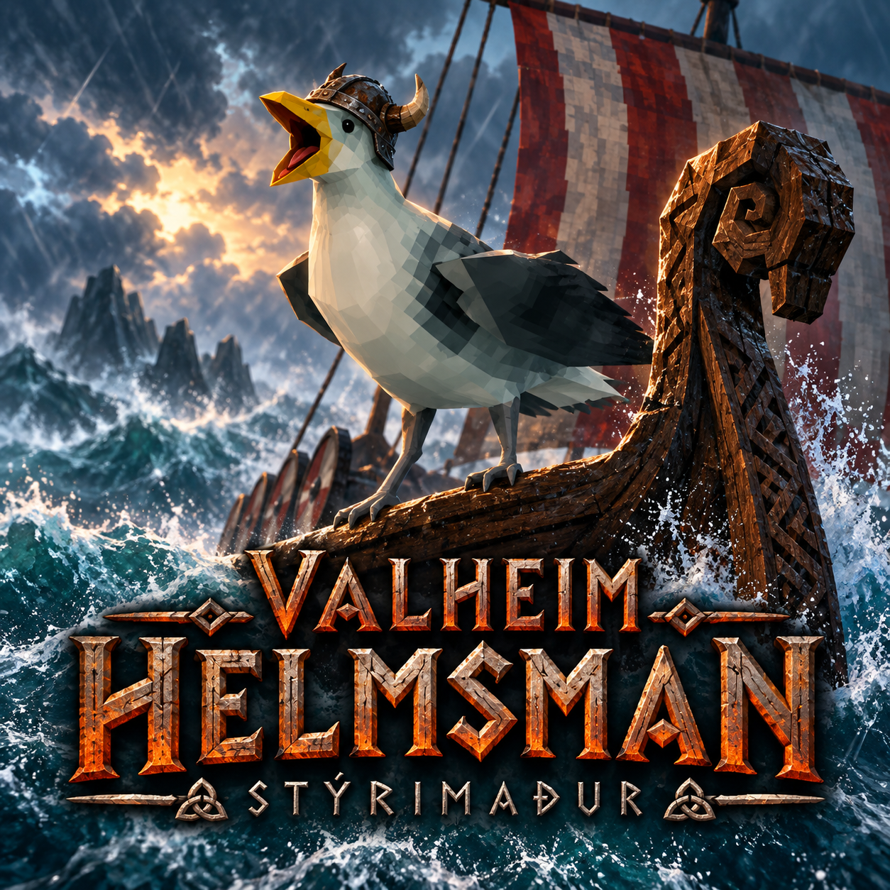

# Valheim Helmsman

**SKRAAA! A captain for your longship. Scratches included.**

## What I do

- **Sail between named docks:** configure a Dock Ward, board and choose a destination. Reverse departures, course changes and clearance checks included.
- **Fetch named ships:** summon an empty ship to a dock, or use a **Gullcall Whistle** for a checked landing near your shoreline. Ships sail there.
- **Explain the hold-up:** a squawk and chat message for blocked routes, shallow water and longer planning delays. Ask **What's happening?** for the current status.
- **Announce arrival:** a squawk, a message and a gull settling on his perch.
- **Show the route:** flowing blue wisps, raised 4 metres. Show/hide from the gull, dock or whistle menu; your choice is saved.
- **Unload with Quartermaster:** request cargo unloading near a Deposit Chest. One slot per step, three thrown trinkets per slot. Nothing unloads without your order.

Helmeted gull, weather reactions and sorting animations included. Supports **Karve, Longship and compatible modded ships**, including eligible OdinShip boats. Rowboats need two seats.

## Get sailing

1. Install **BepInEx** and **Jötunn**, then Helmsman.
2. Build a **Dock Ward** and configure its berth and departure.
3. At the mast, **tap Use to hold fast; hold Use to call the gull**. Speak to him after he lands.

| Control | Action |
|---|---|
| **F8** | Call or speak to the gull |
| **Shift + Use** at the mast | Name the ship |
| Take the helm | Cancel autopilot |

**Gullcall Whistle:** handcraft with **4 bone fragments, 2 wood, 2 leather scraps and 2 feathers**. Use near shore, choose an empty named ship and stay within **64 m** of the calling spot. No dock required.

**Multiplayer untested.** Slow down and release the helm before giving orders. Boat sold pre-scratched.

[GitHub](https://github.com/Vassteel/ValheimHelmsman) · [Discord](https://discord.gg/abN7R2tWyK) · [Guide](GUIDE.md) · [Compatibility](COMPATIBILITY.md)

Code, artwork and documentation developed with generative AI.
